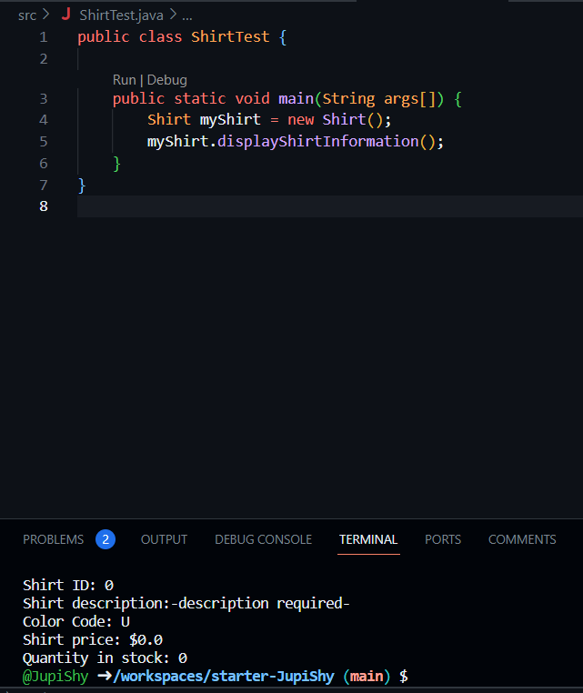
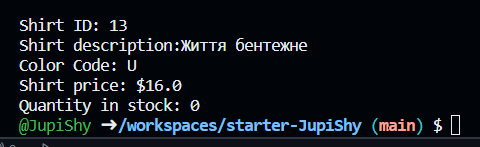
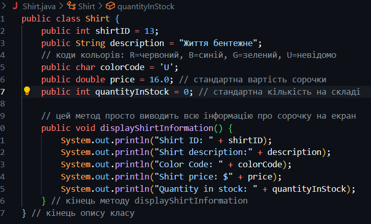
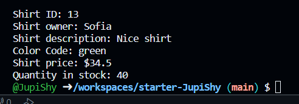

# Завдання 1



#### Замініть у файлі Shirt.java номер сорочки, її опис та вартість довільними значеннями



#### Додаткове завдання
```java
public class Shirt {
    public int shirtID = 13;
    public String owner = "Sofia";
    public String description = "Nice shirt";
    public String colorCode = "green";
    public double price = 34.50;
    public int quantityInStock = 40;

    public void displayShirtInformation() {
        System.out.println("Shirt ID: " + shirtID);
        System.out.println("Shirt owner: " + owner);
        System.out.println("Shirt description: " + description);
        System.out.println("Color Code: " + colorCode);
        System.out.println("Shirt price: $" + price);
        System.out.println("Quantity in stock: " + quantityInStock);
    }
}
```
